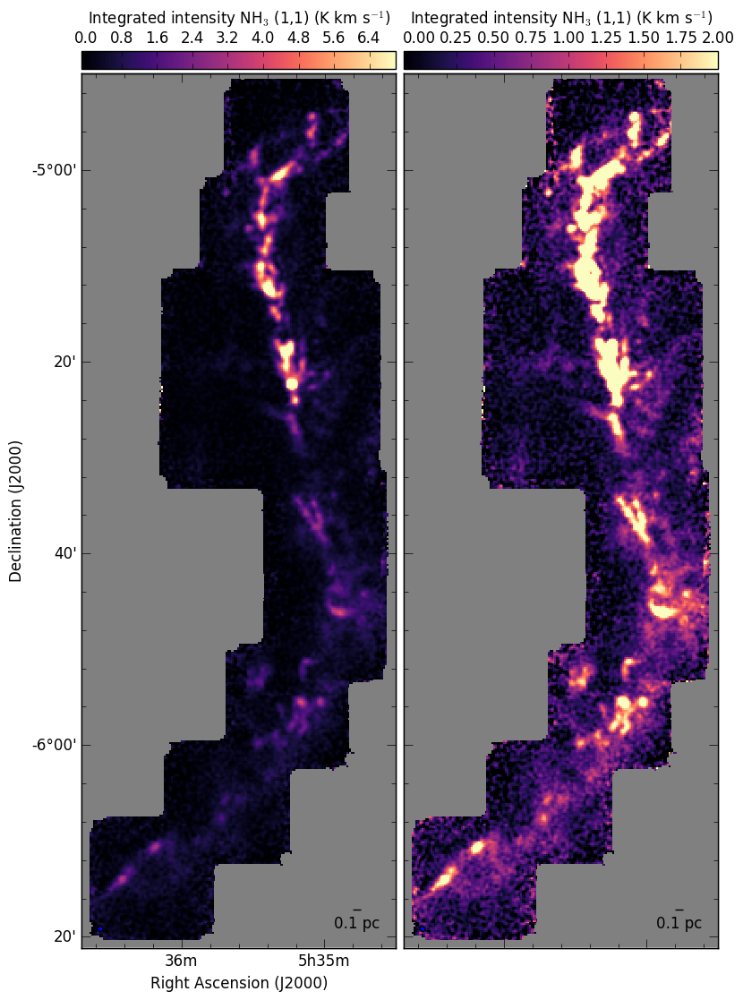
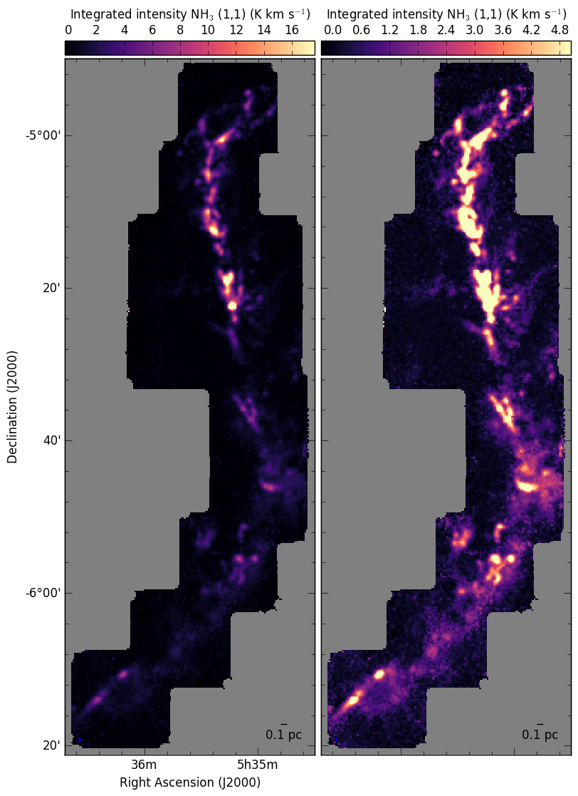

Improved integrated intensity map
---------------------------------

Given the constrains on the First Look functions to keep things simple, the integrated intensity map of the NH\ :sub:`3` lines only include the emission from the main component.
As a solution, we have implemented a function that will use the results from the previous line fitting to determine the channel range with signal for the integrated intensity calculation.
The function `update_NH3_moment0` is within `PropertyMaps` and it will also create a new FITS file for each NH\ :sub:`3` integrated intensity map.

Here is an example of its usage:
    >>> import GAS
    >>> import GAS.PropertyMaps
    >>> GAS.PropertyMaps.update_NH3_moment0(region_name='OrionA', file_extension='_DR1', threshold=0.0125, save_masked=True)

In addition, the function will calculate the uncertainty at each pixel, since the channel range will depend on the line profile.

An example of the improvement in the integrated intensity map is 

compared to the improved maps

